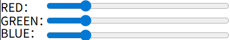

# P5.js Interactive Painting Tool
This is a p5.js-based web drawing application that supports custom brush colors and stroke thickness, complete with a built-in eraser function.
# Online Demo

To run the online demo, click here: [online demo link](https://uob-comsm0166.github.io/2026-group-20/)

# Main function
## Custom Brush
Users can customize the brush color using the sliders.

And users can also customize the brush size by just inputing the size.

## Eraser
Users can clear previous drawings using the eraser tool.

# How to run
## 1. Clone the Repository
Open your terminal or command prompt and run the following command to download the project:  
`git clone https://github.com/UoB-COMSM0166/2026-group-20.git`
## 2. Open the Project
Once the repository is cloned, navigate into the project folder and open the index.html file directly using any web browser (Chrome, Firefox, Safari, etc.).
## 3. Recommended: Use Live Server
For the best experience and to ensure all features function correctly, we highly recommend using the **Live Server** extension in Visual Studio Code.  
* Open the project folder in VS Code.
* Right-click on index.html.
* Select "Open with Live Server".
