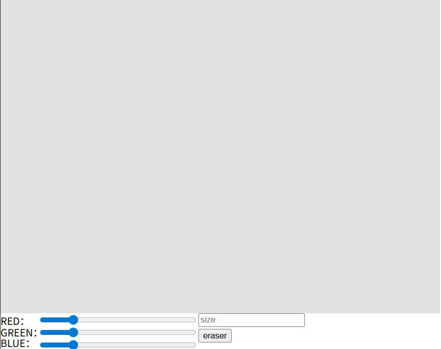

# 2026-group-20
2026 COMSM0166 group 20

# P5.js Interactive Painting Tool
This is a p5.js-based web drawing application that supports custom brush colors and stroke thickness, complete with a built-in eraser function.
# Online Demo

https://uob-comsm0166.github.io/2026-group-20/

# Main function
## Custom Brush
Users can customize the brush color using the sliders.

And users can also customize the brush size by just inputing the size.

