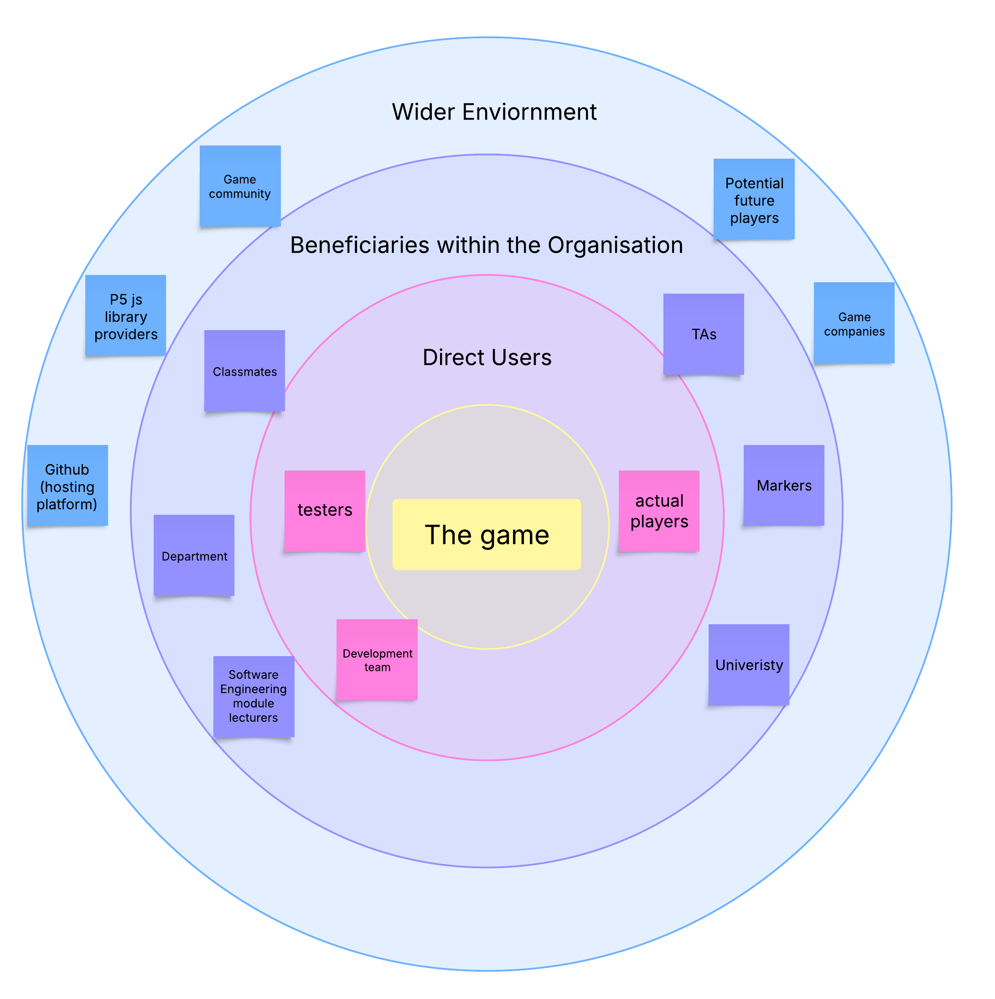
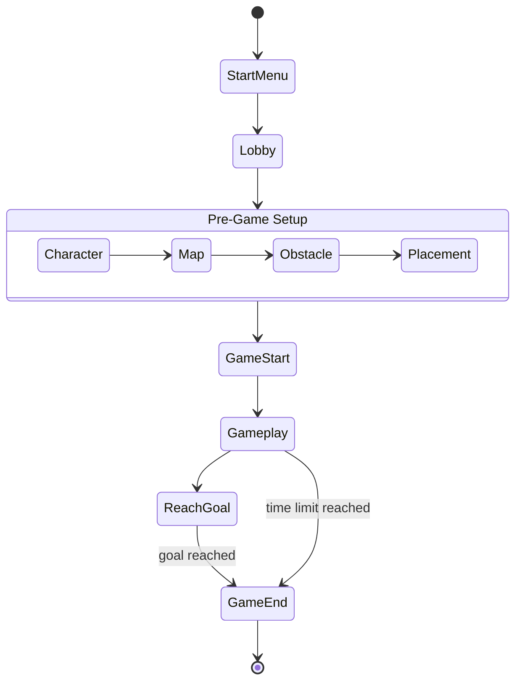
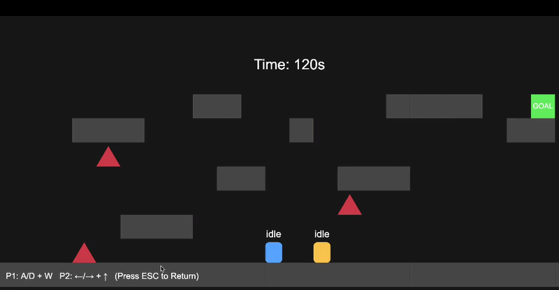
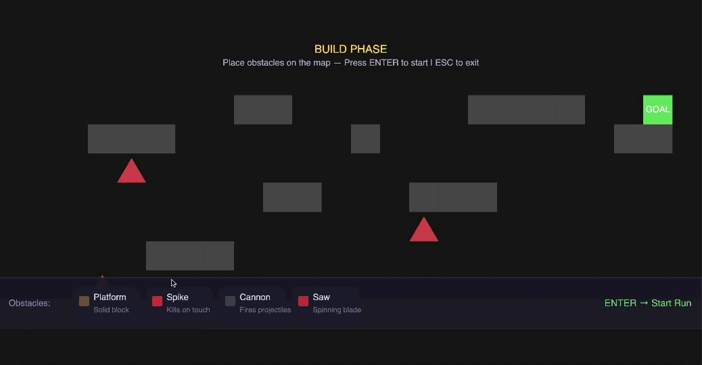
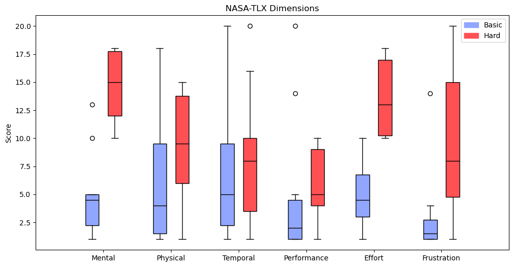
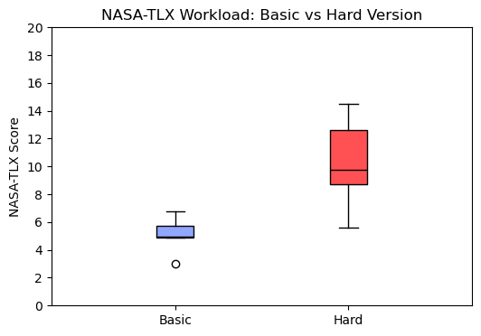
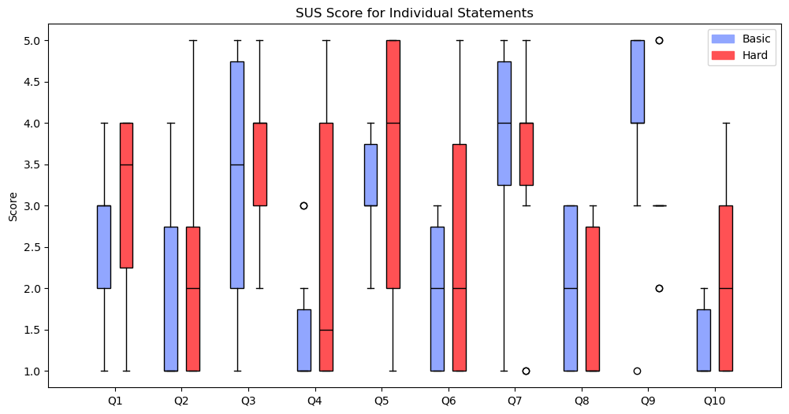
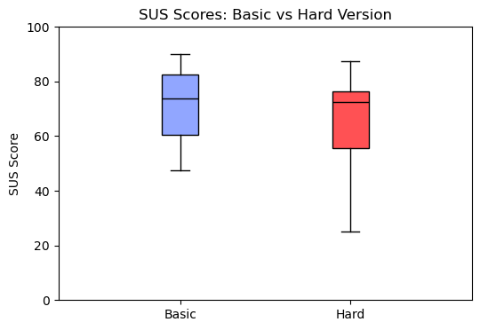

<h1 align="center">The Ultimate Chicken Horse (provisional name) </h1>

<h3 align="center">
  COMSM0166 (2026) · Group 20 
</h3>

<p align="center">
An exciting multiplayer platformer where players design obstacles and race to reach the goal.
</p>

<h3 align="center"> Click <a href="https://uob-comsm0166.github.io/2026-group-20/main-game/"> HERE</a> to play the game (v0.1.0)</h3>

<hr style="border: none; height: 0.5px; background-color:#ddd;">

<h3>VIDEO DEMO (v0.1.0)</h3>

https://github.com/user-attachments/assets/00920bfc-84fc-4969-a731-ab39fba2d5a1

<h3>PAPER DEMO</h3>

https://github.com/user-attachments/assets/4d740826-4f04-4a33-90aa-97b0868dfc5b

<h3>Group Members</h3>

GROUP PHOTO. Add a group photo here.

| Name       | Email                              |
| ---------- | ---------------------------------- |
| Megi       | jd25841@bristol.ac.uk              |
| Maran      | ilamaran.magesh.2025@bristol.ac.uk |
| Jacqueline | oz25232@bristol.ac.uk              |
| Jinwang    | ut25234@bristol.ac.uk              |
| Mengxiao   | dh25275@bristol.ac.uk              |
| Eira       | xz25553@bristol.ac.uk              |


<h3>Project Management</h3>
<p> Our project management is organised in <a href="link"> Lucidspark</a>:</p>

- Brainstorming board - used for idea generation, planning and taking meeting notes
- Kanban board - used for tracking tasks and development progress


<h2 align="center">Project Report</h2>

### 1. Introduction

- 5% ~250 words
- Describe your game, what is based on, what makes it novel? (what's the "twist"?)


### 2. Requirements

-> outlines the requirements engineering process (15% ~750 words)

Our team began by brainstorming various game ideas and collectively selected the concept to develop. After the game was selected, we identified the stakeholders to understand who would be affected by the system and whose needs should be considered during the design process. Based on this understanding, we outlined epics for the game's key features, followed by user stories describing the detailed functional requirements. The overall game flow was then designed to show how players interact with the system.

#### 2.1 Ideation and Game Selection

-> how the idea started

Each member of the team brainstormed 5-9 games of their faviourite games and brought their ideas to the meeting. During the meeting, everyone presented the core game mechanics of their proposed games.


As numerous ideas were proposed, our team decided to first identify the two key challenges: **concurrency** and **AI**. Based on these challenges, each member selected a game that either aligned with or could be adapted to fit the challenges. This process narrowed the selection down to six games.

The team then evaluated which of these games would best support the implementation of chosen challenges. As a result, two games were reduced to two games: **The Ultimate Chicken Horse** and **Among US**.

Both games were analysed to identify the most suitable base for the project. To account for time constraints, our selection involved a trade-off: a feature-rich base game would require fewer technical challenges, whereas a simpler base game would demand more complex implementations to maintain the project's level of difficulty.

|  | <div align="center">Ultimate Chicken Horse<div> | <div align="center">Among Us<div> |
| :---: | :--- | :--- |
|  **Features**   | • Obstacle placement <br> • Characters with different traits <br> • Different obstacles <br> • Scoreboard <br> • Coin collection / wallet system <br> • Timer <br> • Custom graphics | • Task-based mini-games <br> • Visually Distinct characters <br> • Timer <br> • Custom graphics |
| **Concurrency** | • Concurrent player movement <br> • Obstacle placement  | • Concurrent player movement <br> • Task execution |
| **AI Concept**  | AI solver that can be purchased with coins recommends obstacle placement  | AI imposter that decides whom, where and how to attack |

Based on this comparison, **The Ultimate Chicken Horse** was selected as the base game due to its feature-rich design. This ensures that even if time constraints limit the implementation of the planned technical challenges, the project will still remain functional and cohesive as a playable game.

-> Add Appendix A: selection process

#### 2.2 Stakeholders 

-> who is involved

To begin our game design process, we identified all relevant stakeholders including individuals and entities that needed to be taken into account when developing our game. These stakeholders were visualised using an onion model diagram.



Given the academic context of our game, we did not need to account for legal or commercial stakeholders, enabling us to focus on the end users to whom we had direct access. We categorised the most relevant stakeholders into three groups: gamers, lecturers, and other students, to better identify the qualities each group would expect in a game.

- **Gamers**: As primary users, they interact directly with the system. They expect an engaging and enjoyable gameplay experience.

- **Lecturers**: As primary assessors, they evaluate the design process, technical implementation and whether the project meets academic requirements.

- **Other students**: As peer testers, they provide critical feedbacks on bugs and playability.

#### 2.3 Epics

-> high level requirements

Building on our stakeholder analysis, we defined a set of epics (high-level requirements). These requirements were designed to satisfy the expectations of each stakeholder group, as the goal of the project was to develop a game aligns with user expectations.


| <div align="center">Stakeholder Group<div> | <div align="center">Epics<div>|
| :---: | :--- |
|  **Gamers** | • Retro / Nostalgic visuals <br> • Twists or added gameplay features <br> • Visually stimulating design <br> • Background audio and sound effects <br> • Game lore <br> • Core features (wallet system, scoreboard, intro tutorial) <br> • Good UX <br> • Cross-browser compatibility |
| **Lecturers** | • Learning concept integration and application <br> • Clear demonstration of technical challenges <br> • Achievable within the project timeline <br> • Collaborative work <br> • Continuous progress updates <br> • Originality  |
| **Students** | • Social features <br> • Easy to pick up <br> • Short game sessions |

#### 2.4 System Requirements
After defining the epics, we created a set of system requirements to describe what the game should do and how it should perform. The following table presents the key requirements that guided the development of the system.

**Functional Requirements**
| <div align="center">ID<div> | <div align="center"> Category<div> | <div align="center"> Requirement<div>| 
| :---: | :---: | :--- | 
| FR-1 | Input | Two players shall be able to move left, right and jump. Player 1 uses `A`, `D` and `W` keys, whereas player 2 uses `Left`, `Right` and `Up` arrow keys. | 
| FR-2 | Physics | The system shall detect collisions between players and obstacles. | 
| FR-3 | Economy | The game shall implement a wallet system to track coins collected by each player. | 
| FR-4 | Scoreboard | The game shall display a scoreboard to track player progress. | 
| FR-5 | Shop | The game shall provide a shop where players can purchase obstacles using in-game coins. | 
| FR-6 | Respawn | The system shall reset the player to the starting position when the player collides with an obstacle. | 
| FR-7 | Inventory | The game shall allow players to select obstacles from their inventory during gameplay. | 
| FR-8 | Map | The game shall include multiple maps for players to navigate. | 
| FR-9 | Tutorial | The game shall provide a tutorial to introduce new players to the basic gameplay mechanics. | 
| FR-10 | Narrative | The game shall include a lore section to provide background information about the game world and characters. | 

**Non-Functional Requirements**
| <div align="center">ID<div> | <div align="center"> Category<div> | <div align="center"> Requirement<div>| 
| :---: | :---: | :--- | 
| NFR-1 | Visual | The game shall feature retro-style visuals to match the intended theme. | 
| NFR-2 | Audio | The game shall include background music to enhance player immersion. | 
| NFR-3 | Usability | The game interface shall be easy to understand for new players. | 
| NFR-4 | Performance | The game shall maintain smooth gameplay without noticeable lag during play. | 

#### 2.5 User Stories

-> detailed requirements

We deconstructed them into a set of user stories to describe the specific features and functionalities of the game from the perspective of the identified stakeholders.

#### Students

- As a student, I want the game to have a multiplayer mode, so that I can play with my friends.
- As a student, I want the game to have intuitive controls/mechanics, so that I can start playing right away.
- As a student, I want a game run/level to be short enough so that I can play between class breaks.

#### Lecturers

- As a lecturer, I want the game to clearly demonstrate applied programming concepts (e.g., OOP, game logic, UI handling), so that learning outcomes are achieved.
- As a lecturer, I want the game to include defined challenges with measurable outcomes, so that student understanding can be evaluated.
- As a lecturer, I want clear evidence of teamwork (shared commits, divided responsibilities, group meeting notes etc.), so that collaboration skills are demonstrated.

#### Gamers

- As a gamer, I want a scoreboard, so that I can track my performance and try to beat my high score.
- As a gamer, I want a short interactive tutorial, so that I can quickly understand how to play.
- As a gamer, I want intuitive menus and clear navigation, so that I can easily access and play the game without confusion.
- As a gamer, I want responsive sound effects and visual feedback for my actions, so that the game feels immersive and satisfying.

#### 2.6 Use Case Diagram

(~100 words) -> visual overview
add a paragraph here

### 3. Design

(15% ~750 words)

- System architecture. Class diagrams, behavioural diagrams.

#### 3.3 Behaviourial Diagram


```mermaid
stateDiagram-v2

[*] --> StartMenu
StartMenu --> Lobby
Lobby --> PreGameSetup

state "Pre-Game Setup" as PreGameSetup {
    direction LR
    Character --> Map
    Map --> Obstacle
    Obstacle --> Placement
}

PreGameSetup --> GameStart
GameStart --> Gameplay
Gameplay --> ReachGoal

ReachGoal --> GameEnd : goal reached
Gameplay --> GameEnd : time limit reached

GameEnd --> [*]
```

### 4. Implementation

(15% ~750 words)

- Describe implementation of your game, in particular highlighting the TWO areas of _technical challenge_ in developing your game.

note: How the game was built, code architecture 

### 4.2 

### 4.3 Technical Challenge 1 (250 words)

### 4.4 Technical Challenge 2 (250 words)


### 5. Evaluation

(15% ~750 words)
- One qualitative evaluation (of your choice)
- One quantitative evaluation (of your choice)
- Description of how code was tested.

To ensure a robust evaluation of the game’s usability and user experience, we used a mixed-methods approach consisting of the think-aloud method, heuristic evaluation, the System Usability Scale and NASA-TLX. These methods allowed us to identify usability issues and measure user satisfaction so that we could improve later versions of the game. 

#### 5.1 Qualitative Evaluation
(add paragraph)

<div align="center">

</div>

**A. Think Aloud**

The think-aloud method was selected for its efficiency and minimal commitment from participants. During this method, users were asked to verbalise their thoughts while playing the game. This enables us to identify specific usability bottlenecks and understand the reasoning behind user errors as they occurred.

- Most users agreed the player movement controls were smooth. 
- Some users were not aware there was a time limit in the game. 
- Some users did not know realise the game is designed for two players.
- Some users did not know the red triangle is an spike.
- Some users did not know how to start the game as the start button had low constrast with the background
- The goal was difficult to be identified as it was displayed in light green. 
- The goal detection only worked one edge. The second player had to jump over the other player to trigger finish. 
- Most users were unaware that the character could perform a double jump.
- Some players reported that the two players start at slightly different positions, which makes the distance to the goal uneven and the game is unfair. 
- One user reported that the message “Game Over” was discouraging.
- Some users felt that the user interface was too 
- Most users reported there were no instructions that explain the key controls for the game.

**B. Heuristic Evaluation**

To complement user testing, we conducted a Nielsen’s heuristic evaluation, a well-established approach to identify usability issues. This method allowed us to evaluate the interface and identify potential design problems based on recognised usability guidelines.

| Problem No. | Issues | Heuristics Violated | Frequency (0-4) | Impact (0-4) | Persistence (0-4) | Severity |
| :---: |:---:|:---:|:---:|:---:|:---:|:---:|
| 1 | Interface lacked visual guidance (button, spikes, time limit and goal were not clear enough for players to understand what actions to take) | H1 - Visibilty of System Status| 4 | 4 | 4 | 4.0 |
| 2 | Start button had low contrast with the background | H8 – Aesthetic and Minimalist Design | 2 | 3 | 4 | 3.0 |
| 3 | No instructions for game controls | H10 – Help and Documentation | 3 | 4 | 4 | 3.2 |
| 4 | Goal detection only worked on one edge | H5 – Error Prevention | 2 | 3 | 4 | 3.0 |
| 5 | Players started at different positions (an uneven distance to the goal) | H4 – Consistency and Standards | 1 | 1 | 4 | 2.0 |
| 6 | No undo or quick restart option for mistakes | H3 - User Control and Freedom | 3 | 4 | 2 | 3.0 |


The presentation of this table is adapted from the template (4).

#### 5.2. Quantitative Evaluation
(add why chose these two tests)
We conducted a quantitative evaluation to obtain objective and measurable evidence regarding the usability and perceived workload of the two versions of the game. This allowed us to determine whether the increased difficulty affected the usability of the game or the workload experienced by players.
s
<table align="center">
  <tr>
    <th><p align="center">Basic Version</p></th>
    <th><p align="center">Harder Version</p></th>
  </tr>
  <tr>
    <td></td>
    <td></td>
  </tr>
</table>

To perform this evaluation, we recruited ten participants to play both the basic version and the harder version of the game. After completing each version, participants were asked to complete two standardised questionnaires: the System Usability Scale (SUS) and the NASA Task Load Index (NASA-TLX). The SUS questionnaire was used to measure the overall usability of the game, while the NASA-TLX questionnaire was used to assess the perceived workload experienced by players during gameplay.

The collected responses were then converted into numerical scores according to the standard scoring procedures for SUS and NASA-TLX. 

**A. NASA-TLX**

 (add analytical methods)

Our NASA-TLX results indicate that participants experienced a significantly higher workload when playing the harder version of the game, compared to the basic version (p = 0.032). This increase in perceived workload was primarily driven by higher ratings in mental demand (p = 0.002), effort (p = 0.003), and frustration (p = 0.046). These findings suggest that the harder version required greater cognitive effort from players and led to increased frustration during gameplay compared to the basic version. This outcome is consistent with the intended design goal of creating a more challenging gameplay experience.


<div align="center">
    
    
</div>


**B. System Usability Scale (SUS)**

Our SUS results showed no significant difference in usability between the two versions of the game. A SUS score of approximately 68 is generally considered average usability, while scores above 80 indicate excellent usability. The SUS scores obtained in this evaluation (Basic: 70.75, Hard: 64.25) suggest that the usability of the game is currently around the average level. This indicates that increase in difficulty did not negatively affect the usability of the game, as players were still able to understand and interact with the game mechanics in both versions.

However, while the usability is acceptable at this stage, the results also suggest that there is room for improvement to achieve a higher SUS score (e.g. above 80). In particular, feedback from testers suggested that the game could benefit from more intuitive keyboard controls and improved game stage management. For example, a tester reported that they could not undo or adjust obstacles if they were placed incorrectly. Therefore, this feedback will be considered in future iterations of the game in order to improve the overall usability.

 (add sentences saying no statistical significance found)

<div align="center">
    
    
</div>

add Appendix B, captions

#### 5.3 Testing 


### 6. Process

(15% ~750 words)

- Teamwork. How did you work together, what tools and methods did you use? Did you define team roles? Reflection on how you worked together. Be honest, we want to hear about what didn't work as well as what did work, and importantly how your team adapted throughout the project.

Version control and branching strategies 
CICD


#### 6.1 Team Organisation 
Our team operated under a flat and collaborative structure where responsibilities were shared among all members. We did not assign fixed roles for individual team members. Instead, everyone contributed to implementing gameplay systems and programming tasks, while also participating in testing and project management. 

The team adopted a rotating Scrum Master role to support sprint coordination. At the beginning of each sprint, a different team member was selected to act as the Scrum Master. The Scrum Master was responsible for facilitating sprint planning, prioritising tasks in the backlog and monitoring overall progress. Every team member took turns contributing to sprint planning and coordinating overall progress. 

#### 6.2 Tools and Communication 
- **Github**: used for version control and mandatory pull request reviews. 

- **WhatsApp**: primarily channel for day-to-day discussion and coordination. 

- **Lucidspark**: used as a central hub for meeting minutes, brainstorming and the team’s Kanban board.

We held informal daily stand-up meetings while on campus and formal weekly meeting to review overall progress. Additional meetings were arranged when necessary. 

#### 6.3 Development Methodology
The development of this game followed an Agile methodology, organised into two-week sprints to continuously build, test and refine core systems.

**6.3.1. The Product Backlog and Sprint Planning**

The product backlog contained all requirements for the game. These requirements were proposed by team members and agreed upon during the planning phase. 

At the start of each sprint, a sprint planning meeting was conducted by the Scrum Master. After this meeting, team members selected tasks from the prioritised backlog for the upcoming sprint.

During each sprint, the team worked collaboratively to implement features, test functionality and integrate new systems into the existing game framework. Progress was monitored throughout the sprint, and completed tasks were reviewed before moving into the next development cycle.

**6.3.2 Horizontal Development Strategy**

Our team adopted a horizontal development approach to support iterative development. Instead of completing individual systems sequentially, we implemented simplified versions of multiple core systems early in the development process. For example, the player movement system, map layout, obstacle mechanics and wallet system were developed simultaneously using placeholder assets.

This approach was chosen because the gameplay relies heavily on interactions between multiple systems. Mechanics such as player movement must integrate correctly with collision detection and environmental obstacles. Developing these systems independently could delay the discovery of integration issues. For instance, the behaviour of the player movement system can only be properly evaluated when interacting with platforms, obstacles, and other game objects. If such issues are discovered at a later stage of development, the team may have needed to perform refactoring, which could significantly increase development time and complexity.

Additionally, we wanted users to experience the core gameplay at an early stage so that we could gather feedback and identify areas for improvement. For this reason, the team developed basic versions of key systems to produce a Minimum Viable Product (MVP) as early as possible. The game was then progressively refined through subsequent sprint cycles, with placeholder assets replaced and mechanics polished iteratively.

(add a diagram here) 


#### 6.3. Sprint Workflow  

| Sprint | Date | Objective | Scrum Master | <div align="center">Key Tasks<div> | Outcome |
|:---:|:---:|:---:|:---:|:--- |:---:| 
| Sprint 1 | 15 Feb-1 Mar | Initial game prototype | Megi | • Project file structure setup <br> • CI/CD pipeline setup <br> • Basic player movement <br> • Win/Lose detection <br> • Platform detection and Hitbox system <br> • Start screen <br> • Death/Respawn system | Initial playable prototype (v0.1.0) completed |
| Sprint 2 | 2 Mar-16 Mar | Core gameplay systems | Maran | • HUD Overlay and Scoreboard <br> • Reward Algorithm <br> • Character animation <br> • Character sprites and animation <br> • Map data structure and map design <br> • Coin entity and wallet system <br> • State manager | Core gameplay mechanics implemented | 
| Sprint 3 | 17 Mar-30 Mar | Feature expansion | Jacqueline | • Ice and forest maps <br> • Global configuration system <br> • Shop system and player inventory <br> • Audio implementation <br> • Return buttons and UI improvements <br> • AI obstacle placement <br> • Obstacle animation <br> • Lore  <br> • Tutorial <br> • Lobby <br> • Pause Manager | - | 
| Sprint 4 | 31 Mar-13 Apr | Testing and gameplay refinement | - | • Bug fixing <br> • UI improvement (add) | - |  
| Sprint 5 | 14 Apr-24 Apr | Final polishing and deployment preparation | - | • Final bug fixing <br> • Final testing <br> • Deployment preparation | - |  


#### 6.4. Branching Strategy
Our repository follows a structured branching strategy to ensure code quality and deployment stability: 

- **Main branch** - The `main` branch always hosts production-ready and stable code. Code is only merged into `main` after it has been fully tested in the development branch. All merges into `main` require a Pull Request (PR). 

- **Development branch** - The `dev` branch is an integration branch. All new features and fixes are merged here first. Code in  `dev` must be carefully tested and validated before it is promoted to the `main` branch. 

- **Feature branches** - The `feature` branches are used to develop individual features in isolation. These branches are created from `dev`. Merging a feature branch back to `dev` also require a PR. 

**Approval**: Every PR must be reviewed and approved by at least one other team member. 

Our branch structure:

```
main
 └── dev
      ├── feature/basicMovement
      ├── feature/shop
      ├── feature/mapDesign
      └── feature/sharedKeyboard
      ...
```

#### 6.5 Project File Structure 


#### 6.7. Build and Deployment Pipeline 
 

#### 6.8. Reflection on Teamwork 


### 7. Conclusion

(10% ~500 words)

- Reflect on the project as a whole. Lessons learnt. Reflect on challenges. Future work, describe both immediate next steps for your current game and also what you would potentially do if you had chance to develop a sequel.


### 8. Contribution Statement

- Provide a table of everyone's contribution, which _may_ be used to weight individual grades. We expect that the contribution will be split evenly across team-members in most cases. Please let us know as soon as possible if there are any issues with teamwork as soon as they are apparent and we will do our best to help your team work harmoniously together.

### Reference
[1]J. Joe, S. Chaudhuri, T. Le, H. Thompson, and G. Demiris, “The use of think-aloud and instant data analysis in evaluation research: Exemplar and lessons learned,” Journal of Biomedical Informatics, vol. 56, pp. 284–291, Aug. 2015, doi: 10.1016/j.jbi.2015.06.001. (add to why choose think aloud)

[2]“A comparison of heuristics applied for studying the usability of websites,” Procedia Computer Science, vol. 176, pp. 3571–3580, doi: 10.1016/j.procs.2020.09.029. (add to why we choose heuristics)

[3]J. Nielsen, “10 Usability Heuristics for User Interface Design,” Nielsen Norman Group, Apr. 24, 1994. Accessed: Mar. 16, 2026. [Online]. Available: https://www.nngroup.com/articles/ten-usability-heuristics/ (heuristics principles for Nielsen)
  

[4]K. Chaudhary, X. Dai, and J. Grundy, “Experiences in Developing a Micro-payment System for Peer-to-Peer Networks,” International Journal of Information Technology and Web Engineering, vol. 5, no. 1, pp. 23–42, Jan. 2010, doi: 10.4018/jitwe.2010010102. (heurstics format)


### Appendix

You can delete this section in your own repo, it's just here for information. in addition to the marks above, we will be marking you on the following two points:

- **Quality** of report writing, presentation, use of figures and visual material (5% of report grade)
    - Please write in a clear concise manner suitable for an interested layperson. Write as if this repo was publicly available.
- **Documentation** of code (5% of report grade)
    - Organise your code so that it could easily be picked up by another team in the future and developed further.
    - Is your repo clearly organised? Is code well commented throughout?
