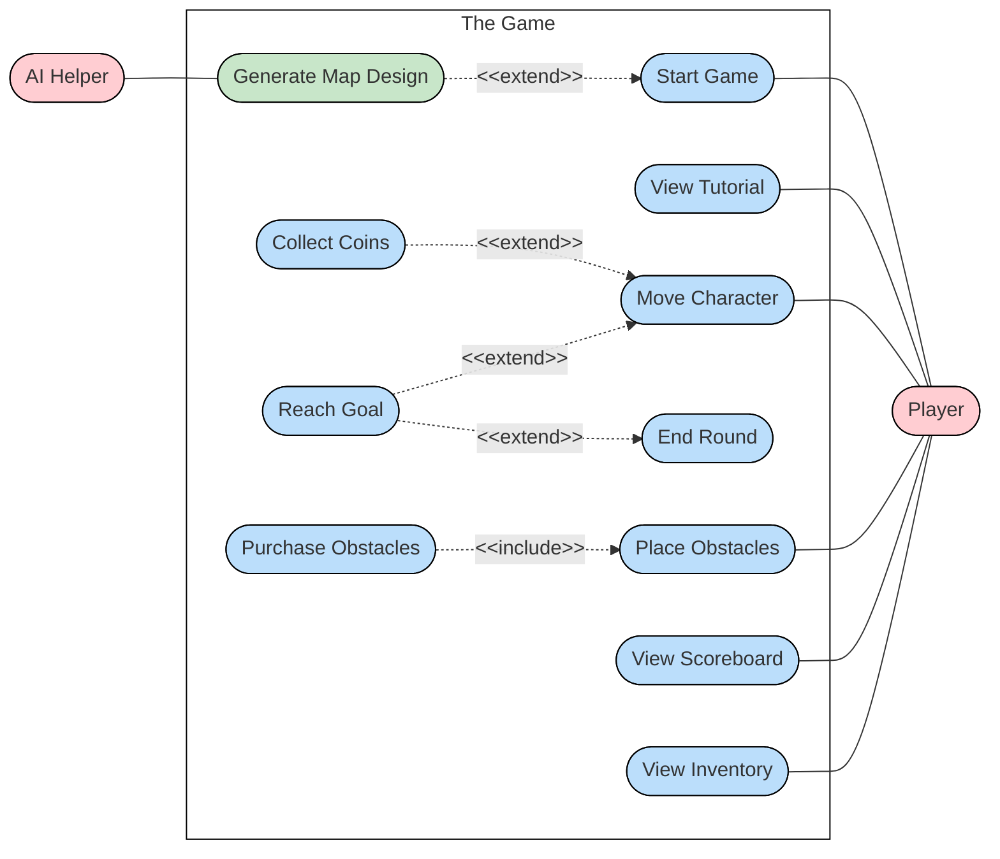
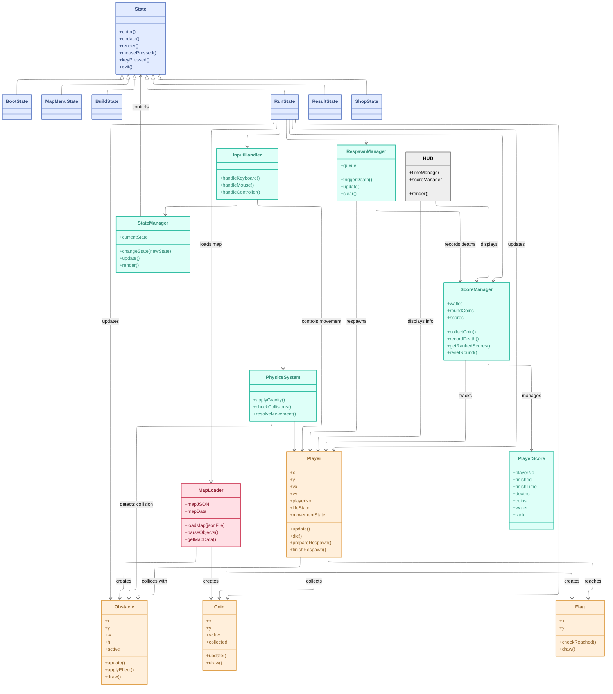
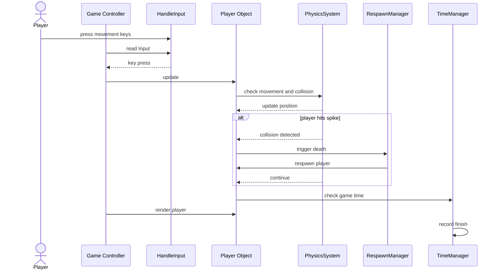
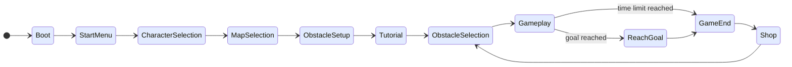
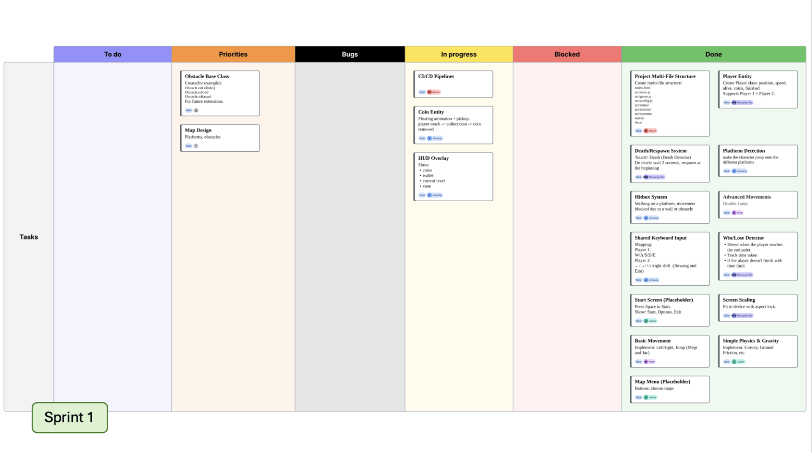
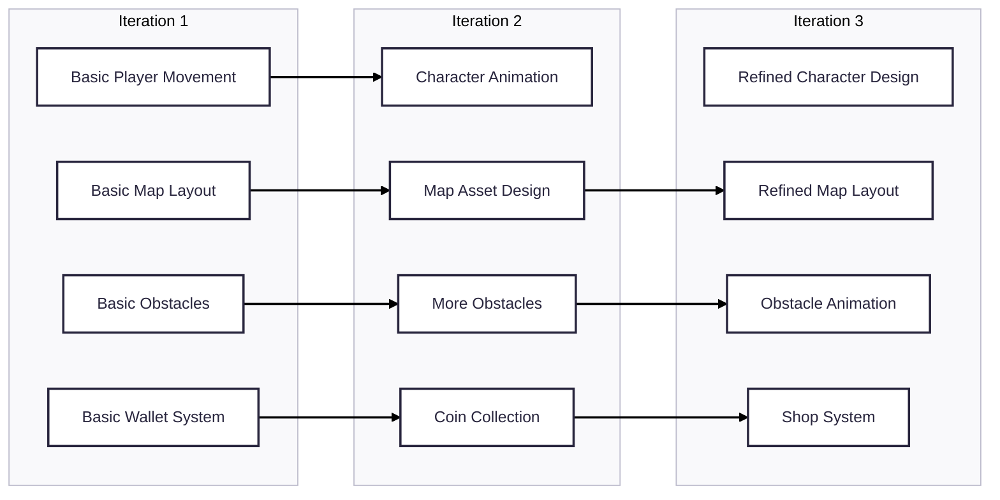
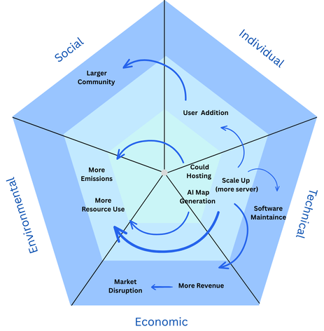

<h1 align="center">The Incredible ChickenBunny </h1>

<h3 align="center">
  COMSM0166 (2026) · Group 20 
</h3>

<p align="center">
The Incredible ChickenBunny: an exciting multiplayer platformer where players select map obstacles and race to reach the goal.
</p>

<h3 align="center"> Click <a href="https://uob-comsm0166.github.io/2026-group-20/main-game/"> HERE</a> to play the game (v0.1.0)</h3>

<hr style="border: none; height: 0.5px; background-color:#ddd;">

<h3>VIDEO DEMO (v0.1.0)</h3> 
2-3 mins long no more than 3 mins 
intro of the game (optional) 
explain concept of the game and twists
explain challanges (in the game) 
team formation 
explain the process (sprints, kanban board...) 

https://github.com/user-attachments/assets/00920bfc-84fc-4969-a731-ab39fba2d5a1

<h3>PAPER DEMO</h3>

https://github.com/user-attachments/assets/4d740826-4f04-4a33-90aa-97b0868dfc5b

<h3>Group Members</h3>

GROUP PHOTO. Add a group photo here.

| Name       | Email                              | Role                                                     | GitHub Account 
| ---------- | ---------------------------------- | -------------------------------------------------------- | ----------------
| Megi       | jd25841@bristol.ac.uk              | Developer, Graphics Designer, UI Designer, Audio Curator | <a href= "https://github.com/mgbego"> mgbego
| Maran      | ilamaran.magesh.2025@bristol.ac.uk | Developer, AI Engineer, Build Engineer                   | <a href= "https://github.com/IlamaranMagesh"> IlamaranMagesh
| Jacqueline | oz25232@bristol.ac.uk              | Developer, Graphics Designer, UI Designer, Audio Curator | <a href= "https://github.com/liilee111"> liilee111
| Jinwang    | ut25234@bristol.ac.uk              | Developer, UX Designer, Audio Designer                   | <a href= "https://github.com/Arupin-uk"> Arupin-uk
| Mengxiao   | dh25275@bristol.ac.uk              | Developer, UI Designer, Level Designer                   | <a href= "https://github.com/MengW7"> MengW7
| Eira       | xz25553@bristol.ac.uk              | Developer, UX Designer, Audio Designer                   | <a href= "https://github.com/Libing42024"> Libing42024


<h3>Project Management</h3>
<p> Our project management is organised in <a href="link"> Lucidspark</a>:</p>

- Brainstorming board - used for idea generation, planning and taking meeting notes
- Kanban board - used for tracking tasks and development progress

<h3>Repository Structure</h3>

```
2026-GROUP-20/
├─ .github/
│  └─ workflows/
│     ├─ pre-build.yml        # CI workflow for checks before build
│     └─ release.yml          # CI/CD workflow for build and deployment
│
├─ .husky/                    # Pre-commit hook configuration
├─ docs/                      # Project documentation
│
├─ src/                       # source code
│  ├─ assets/                 
│  ├─ config/                
│  ├─ entities/               
│  ├─ maps/                 
│  ├─ state/                  
│  ├─ systems/                
│  ├─ utils/                  
│  ├─ ui/                    
│  ├─ main.js                 
│  ├─ sketch.js              
│  └─ style.css              
│
├─ tests/                     # Unit tests
│
├─ .gitignore                 # Git ignore rules
├─ .nvmrc                     # Node.js version configuration
├─ .prettierignore            # Prettier ignore rules
├─ .prettierrc                # Prettier formatting rules
├─ eslint.config.js           # ESLint configuration
├─ index.html                 
├─ package.json               # Project dependencies 
├─ README.md               
└─ vite.config.js             # Vite development and build configuration
```


<h2 align="center">Project Report</h2>

## 1. Introduction

- 5% ~250 words
- Describe your game, what is based on, what makes it novel? (what's the "twist"?)

<p>
<strong><i>The Incredible ChickenBunny</i></strong> is a newly developed and enhanced adaptation of the multiplayer platformer game <strong><i>Ultimate Chicken Horse</i></strong>. The original game was chosen as inspiration due to its distinctive multiplayer mechanics, in which players strategically select obstacles from an in-game shop and place them on the map in order to gain an advantage while simultaneously making the course more difficult for their opponents. This unique gameplay mechanism creates a dynamic balance between cooperation and competition, making the game very engaging. The original game also features colourful cartoon-style character sprites that contribute to a visually appealing aesthetic suitable for players of all age groups.

During our game development, these core elements were preserved, while introducing several new gameplay and visual design enhancing features.

To enhance immersion and variety, two themed environments were designed: a forest and an ice theme, each with their unique set of characters; a chicken and a bunny for the forest, and a polar bear and a penguin for the ice map.
Furthermore, a coin and wallet system was implemented to increase competitiveness and player engagement. During each run, players can collect coins placed throughout the level, which can then be used to purchase better and more expensive obstacles in subsequent rounds. A compulsory timer was also introduced, replacing the optional timer in the original game, in order to increase tension and make the game more high-stakes. Finally, each game run generates a new skeleton map and resets all previously placed obstacles. This procedural variation differs from the original, preventing players from predicting the layout and encouraging creative strategies when placing obstacles.
</p>


## 2. Requirements

(15% ~750 words)

Our team began by brainstorming various game ideas and collectively selected the concept to develop. After the game was selected, we identified the stakeholders to understand who would be affected by the system and whose needs should be considered during the design process. Based on this understanding, we outlined epics for the game's key features, followed by user stories describing the detailed functional requirements. 

### 2.1 Ideation and Game Selection

Each member of the team brainstormed 5-9 of their faviourite games and brought their ideas to the meeting. During the meeting, everyone presented the core game mechanics of their proposed games.


As numerous ideas were proposed, our team decided to first decide on the two key challenges: **concurrency** and **AI**. Based on the alignment with these challenges, the top six games were selected. 

From there, **Ultimate Chicken Horse** and **Among US** were voted as the best potential choices.

Both games were analysed to identify the most suitable base for the project. To account for time constraints, our selection involved a trade-off: a feature-rich base game would require fewer technical challenges, whereas a simpler game would demand more complex challenges, but have more straightforward rules and design. Based on this comparison, **Ultimate Chicken Horse** was selected as the winner as it was concluded it would allow for a more well-rounded, enjoyable gameplay for the users.

|  | <div align="center">Ultimate Chicken Horse<div> | <div align="center">Among Us<div> |
| :---: | :--- | :--- |
|  **Features**   | • Obstacle placement <br> • Characters with different traits <br> • Different obstacles <br> • Scoreboard <br> • Coin collection / wallet system <br> • Timer <br> • Custom graphics | • Task-based mini-games <br> • Visually Distinct characters <br> • Timer <br> • Custom graphics |
| **Concurrency** | • Concurrent player movement <br> • Obstacle placement  | • Concurrent player movement <br> • Task execution |
| **AI Concept**  | AI solver that can be purchased with coins recommends obstacle placement  | AI imposter that decides whom, where and how to attack |

<div align="center">
<p><em>Table 1: Ultimate Chicken Horse and Among Us Comparison Table. </em></p>
</div>


### 2.2 Stakeholders 

To begin our game design process, we identified all relevant stakeholders including individuals and entities that needed to be taken into account when developing our game. These stakeholders were visualised using an onion model diagram (see Figure ?).

<div align="center">
  
</div>

<div align="center">
<p><em>Figure 1: Onion model of the game stakeholders. (Presntation of the table was adapted from [<a href="#reference">10</a>]) </em></p>
</div>

Given the academic context of our game, we did not need to account for legal or commercial stakeholders, enabling us to focus on the end users who are directly implicated. We categorised the most relevant stakeholders into three groups: gamers, lecturers, and other students, to better identify the qualities each group would expect in a game.

- **Gamers**: As primary users, they interact directly with the system. They expect an engaging and enjoyable gameplay experience.

- **Lecturers**: As primary assessors, they evaluate the design process, technical implementation and whether the project meets academic requirements.

- **Other students**: As peer testers, they provide critical feedback on bugs and usability.

### 2.3 Epics

Building on our stakeholder analysis, a set of epics (high-level requirements) were defined. These requirements are meant to satisfy the expectations of each stakeholder group, as the goal of the project is to develop a game aligns with user expectations.


| <div align="center">Stakeholder Group<div> | <div align="center">Epics<div>|
| :---: | :--- |
|  **Gamers** | • Retro / Nostalgic visuals <br> • Twists or added gameplay features <br> • Visually engaging design <br> • Background audio and sound effects <br> • Core features (wallet system, scoreboard, intro tutorial) <br> • Good UX |
| **Lecturers** | • Learning concept integration and application <br> • Clear demonstration of technical challenges <br> • Achievable within the project timeline <br> • Effective collaborative work <br> • Continuous progress updates <br> • Originality  |
| **Students** | • Social features <br> • Easy to pick up <br> • Short game sessions |

<div align="center">
<p><em>Table 2: Summary of Stakeholder groups and game Epics</em></p>
</div>

### 2.4 System Requirements
After defining the epics, we created a set of system requirements to describe what the game should do and how it should perform. The following table outlines the key functional and non-functional requirements.

**Functional Requirements**
| <div align="center">ID<div> | <div align="center"> Category<div> | <div align="center"> Requirement<div>| 
| :---: | :---: | :--- | 
| FR-1 | Input | Two players shall be able to move left, right and jump. Player 1 uses `A`, `D` and `W` keys, whereas player 2 uses `Left`, `Right` and `Up` arrow keys. | 
| FR-2 | Physics | The system shall detect collisions between players and obstacles. | 
| FR-3 | Economy | The game shall implement a wallet system to track coins collected by each player. | 
| FR-4 | Scoreboard | The game shall display a scoreboard to track player progress. | 
| FR-5 | Shop | The game shall provide a shop where players can purchase obstacles using in-game coins. | 
| FR-6 | Respawn | The system shall reset the player to the starting position when the player dies. | 
| FR-7 | Inventory | The game shall allow players to select obstacles from their inventory during the build phase. | 
| FR-8 | Map | The game shall include multiple maps for players to navigate. | 
| FR-9 | Tutorial | The game shall provide a tutorial to introduce new players to the basic gameplay mechanics. | 
 
 <div align="center">
<p><em>Table 3: Functional System Requirements</em></p>
</div>

**Non-Functional Requirements**
| <div align="center">ID<div> | <div align="center"> Category<div> | <div align="center"> Requirement<div>| 
| :---: | :---: | :--- | 
| NFR-1 | Visual | The game shall feature retro-style visuals to match the intended theme. | 
| NFR-2 | Audio | The game shall include background music to enhance player immersion. | 
| NFR-3 | Usability | The game interface shall be easy to understand for new players. | 
| NFR-4 | Performance | The game shall maintain smooth gameplay without noticeable lag during play. | 

<div align="center">
<p><em>Table 4: Non-functional System Requirements</em></p>
</div>

### 2.5 User Stories

We deconstructed epics into a set of user stories to describe the specific features and functionalities of the game from the perspective of the identified stakeholders.

### Students

- As a student, I want the game to have a multiplayer mode, so that I can play with my friends.
- As a student, I want the game to have intuitive controls/mechanics, so that I can start playing right away.
- As a student, I want a game run to be short enough so that I can play between lecture breaks.

### Lecturers

- As a lecturer, I want the game to clearly demonstrate applied programming concepts (e.g., OOP, game logic, UI handling), so that learning outcomes are achieved.
- As a lecturer, I want the game to include defined challenges with measurable outcomes, so that student performance can be evaluated.
- As a lecturer, I want clear evidence of teamwork (shared commits, divided responsibilities, group meeting notes etc.), so that collaboration skills are demonstrated.

### Gamers

- As a gamer, I want a scoreboard, so that I can track my performance and try to beat my high score.
- As a gamer, I want a short interactive tutorial, so that I can quickly understand how to play.
- As a gamer, I want intuitive menus and clear navigation, so that I can easily access and play the game without confusion.
- As a gamer, I want responsive sound effects and visual feedback for my actions, so that the game feels immersive and satisfying.

### 2.6 Use Case Diagram

Based on the requirements identified in the previous section, the system design was developed to support the key gameplay interactions, illustrated in Figure 2. 

The primary actor is the **Player**. The player can perform core actions such as starting the game, viewing the tutorial, moving the character, placing obstacles and montinoring their progression via the scoreboard. During the game, the player may also collect coins and end the round by reaching the goal. Additionally, the player can optionally use the coins collected during the game to purchase new obstacles.

The **AI solver** acts as a secondary actor responsible for generating obstacle recommendations when requested by the player. 


```mermaid
flowchart LR
 subgraph TheGame["The Game"]
    direction TB
        UC_Start(["Start Game"])
        UC_Tutorial(["View Tutorial"])
        UC_Move(["Move Character"])
        UC_Coins(["Collect Coins"])
        UC_Goal(["Reach Goal"])
        UC_End(["End Round"])
        UC_Place(["Place Obstacles"])
        UC_Purchase(["Purchase Obstacles"])
        UC_Generate(["Generate Map Design"])
        UC_Score(["View Scoreboard"])
        UC_Inv(["View Inventory"])
  end
    UC_Start --- Player(["Player"])
    UC_Tutorial --- Player
    UC_Move --- Player
    UC_Place --- Player
    UC_Score --- Player
    UC_Inv --- Player
    AISolver(["AI Helper"]) --- UC_Generate
    UC_Generate -. &lt;&lt;extend&gt;&gt; .-> UC_Start
    UC_Coins -. &lt;&lt;extend&gt;&gt; .-> UC_Move
    UC_Goal -. &lt;&lt;extend&gt;&gt; .-> UC_Move & UC_End
    UC_Purchase -. &lt;&lt;include&gt;&gt; .-> UC_Place

    style UC_Start fill:#BBDEFB,stroke:#000000
    style UC_Tutorial fill:#BBDEFB,stroke:#000000
    style UC_Move fill:#BBDEFB,stroke:#000000
    style UC_Coins fill:#BBDEFB,stroke:#000000
    style UC_Goal fill:#BBDEFB,stroke:#000000
    style UC_End fill:#BBDEFB,stroke:#000000
    style UC_Place fill:#BBDEFB,stroke:#000000
    style UC_Purchase fill:#BBDEFB,stroke:#000000
    style UC_Generate fill:#C8E6C9,stroke:#000000
    style UC_Score fill:#BBDEFB,stroke:#000000
    style UC_Inv fill:#BBDEFB,stroke:#000000
    style Player fill:#FFCDD2,stroke:#000000
    style AISolver fill:#FFCDD2,stroke:#000000
    style TheGame fill:#ffffff,stroke:#000000

```
<div align="center">
<p><em>Figure 2: Use case diagram of the game system.</em></p>
</div>

## 3. Design

(15% ~750 words)

- System architecture. Class diagrams, behavioural diagrams.

### 3.1 System Architecture Overview

The project adopts a modular game architecture that combines **Entity–Component–System (ECS)** architecture[5] and **Object-Oriented Design**[9]. 
An ECS architecture separates data from logic. Entities mainly store data, while systems contain all the logic that processes this data. For instance, a **Player** entity may only store position and velocity data, while the **Physics System** is responsible for updating movement or detecting collisions for multiple entities (see Figure ). 
In contrast, in typical Object-Oriented Design, a game object contains both its data and the logic that operates on that data. For example, a **Player** class may store data such as position and velocity while also containing functions that control movement and detect collisions. 

 

#### OOP approach 
```
Player
 ├─ position
 ├─ velocity
 ├─ move()
 └─ detectCollision()
``` 

#### ECS approach 
```
Player Entity
 ├─ PositionComponent
 └─ VelocityComponent

PhysicsSystem
 └─ updates movement and collision
```
<div align="center">
<p><em>Figure 3: Conceptual comparison between object-oriented design and ECS architecture.</em></p>
</div>

Both architectures have advantages and limitations. Object-Oriented Design is easier to understand and implement as data and behaviour are encapsulated within the same class. This structure suits smaller projects where logic is organised around individual objects. However, as systems become more complex, tightly coupling logic within objects can reduce flexibility and limit code reusability [9, p.113]. In contrast, ECS architecture improves modularity by separating data from behaviour, allowing systems to process multiple entities using shared logic. This can improve scalability and maintainability, but it may introduce additional design complexity[6]. 

Based on these considerations, the system architecture in this project follows a **hybrid approach**, which combines aspects of both ECS and object-oriented design. The player is represented as an **entity** that stores data such as position and movement speed, while certain gameplay behaviours are handled by independent systems. For instance, the PhysicsSystem processes collision detection between the player and obstacles, and the RespawnManager handles resetting the player when the character collides with a hazard. However, some game logic, such as the player movement, remains implemented within the player object itself.

The project was initially planned to follow a strictly object-oriented approach. However, during development, this resulted in increased coupling between components, making the system more difficult to modify and extend (e.g., changes to collision logic required updates across multiple object classes). To address this limitation, elements of the ECS architecture were introduced to separate data from behaviour and reduce these dependencies. This led to the adoption of a hybrid approach, combining the organisational clarity of object-oriented design with the improved modularity and scalability of ECS.

This hybrid architectural approach is reflected in the organisation of the project’s codebase. The codebase is divided into several folders: `entities`, `systems`, `state`, `config`, `UI` and `resource manager`, each responsible for a specific aspect of the game. These categories correspond to the coloured groups in the class diagram (Figure 4). 


```mermaid
---
config:
  layout: elk
  theme: neutral
---
classDiagram
direction TB
    class StateManager {
	    +currentState
	    +changeState(newState)
	    +update()
	    +render()
    }

    class InputHandler {
	    +handleKeyboard()
	    +handleMouse()
	    +handleController()
    }

    class State {
      +enter()
	    +update()
	    +render()
	    +mousePressed()
	    +keyPressed()
	    +exit()
    }

    class BootState
    class MapMenuState
    class BuildState
    class RunState
    class ResultState
    class ShopState

    class PhysicsSystem {
	    +applyGravity()
	    +checkCollisions()
	    +resolveMovement()
    }

    class MapLoader {
	    +mapJSON
	    +mapData
	    +loadMap(jsonFile)
	    +parseObjects()
	    +getMapData()
    }

    class ScoreManager {
	    +wallet
	    +roundCoins
	    +scores
	    +collectCoin()
	    +recordDeath()
	    +getRankedScores()
	    +resetRound()
    }

    class RespawnManager {
	    +queue
	    +triggerDeath()
	    +update()
	    +clear()
    }

    class HUD {
	    +timeManager
	    +scoreManager
	    +render()
    }

    class Player {
	    +x
	    +y
	    +vx
	    +vy
	    +playerNo
	    +lifeState
	    +movementState
	    +update()
	    +die()
	    +prepareRespawn()
	    +finishRespawn()
    }

    class Obstacle {
	    +x
	    +y
	    +w
	    +h
	    +active
	    +update()
	    +applyEffect()
	    +draw()
    }

    class Coin {
	    +x
	    +y
	    +value
	    +collected
	    +update()
	    +draw()
    }

    class Flag {
	    +x
	    +y
	    +checkReached()
	    +draw()
    }

    class PlayerScore {
	    +playerNo
	    +finished
	    +finishTime
	    +deaths
	    +coins
	    +wallet
	    +rank
    }

    StateManager --> State : controls
    InputHandler --> StateManager : 
    State <|-- BootState
    State <|-- MapMenuState
    State <|-- BuildState
    State <|-- RunState
    State <|-- ResultState
    State <|-- ShopState
    InputHandler --> Player : controls movement
    RunState --> InputHandler 
    RunState --> PhysicsSystem 
    RunState --> MapLoader : loads map
    RunState --> ScoreManager 
    RunState --> RespawnManager
    RunState --> Player : updates
    RunState --> Obstacle : updates
    RunState --> Coin 
    PhysicsSystem --> Player 
    PhysicsSystem --> Obstacle : detects collision
    MapLoader --> Obstacle : creates
    MapLoader --> Coin : creates
    MapLoader --> Flag : creates
    ScoreManager --> Player : tracks
    ScoreManager --> PlayerScore : manages
    RespawnManager --> Player : respawns
    RespawnManager --> ScoreManager : records deaths
    HUD --> Player : displays info
    HUD --> ScoreManager : displays
    Player --> Obstacle : collides with
    Player --> Coin : collects
    Player --> Flag : reaches

	class StateManager:::Aqua
	class InputHandler:::Aqua
	class State:::Sky
	class BootState:::Sky
	class MapMenuState:::Sky
	class BuildState:::Sky
	class RunState:::Sky
	class ResultState:::Sky
	class ShopState:::Sky
	class PhysicsSystem:::Aqua
	class MapLoader:::Rose
	class ScoreManager:::Aqua
	class RespawnManager:::Aqua
	class HUD:::Ash
	class Player:::Peach
	class Obstacle:::Peach
	class Coin:::Peach
	class Flag:::Peach
	class PlayerScore:::Aqua

	classDef Sky fill:#E2EBFF,stroke:#6B86C9,color:#374D7C,stroke-width:2px
  classDef Peach fill:#FFEFDB,stroke:#E0A24F,color:#8F632D,stroke-width:2px
  classDef Aqua fill:#DEFFF8,stroke:#35BFA5,color:#378E7A,stroke-width:2px
  classDef Rose fill:#FFDFE5,stroke:#D24A64,color:#8E2236,stroke-width:2px
  classDef Ash fill:#EEEEEE,stroke:#888888,color:#000000,stroke-width:2px
```
<div align="center">
<p><em>Figure 4: Class diagram of the system architecture. Colours indicate different class groups: entities (amber), states (blue), systems (green), resource manager (red) and UI (grey).</em></p>
</div>


### 3.2 Entities 

**Entities** represent the main objects within the game world, such as players, coins and obstacles. These entities store important state information, such as position, velocity and phase (e.g., lifeState, movementState and gameState), and also implement some game logic. This structure adheres to a data-driven design approach [5, p1024], where specific parameters such as movement speed and initial jump velocity are defined in configuration files in the `config` folder rather than hardcoded.

During runtime, entities are updated through the **game loop** (`draw()`). All entities are stored in a list, and the `update()` function iterates through this list during each frame to update the state of each entity sequentially. This approach ensures a consistent and accurate update of the entities during the game run [5, p1088].


### 3.3 Systems
**Systems** are responsible for processing behaviours associated with different enities and implementing core gameplay mechanics. While **Entities** mainly store data, **Systems** contain most of the logic that operates on this data during each iteration of the game loop, which is contained within the `system` directory. 

Core gameplay behaviour is therefore driven by these systems, which manage interactions between entities. For example, a collision or physics system detects when the player intersects with a coin, triggering its collection and removal, while collisions with deadly obstacles initiate a respawn, and reaching the flag signals level completion. In this way, systems update entity states and ensure consistent game progression during runtime.

Examples of **Systems** include: 

- `Physics System` - detects collisions between the player and other entities (e.g. coins, platforms, spikes etc.)

- `Respawn Manager` - manages the respawning of the players and ensures they are correctly repositioned at the starting point.

- `Time Manager` - manages gameplay timing during a round.

Figure 5 displays how the player interact with these systems during gameplay.

```mermaid
---
config:
  theme: mc
---
sequenceDiagram
    actor Player
    participant Sketch as Game Controller
    participant Input as HandleInput
    participant P as Player Object
    participant Physics as PhysicsSystem
    participant Respawn as RespawnManager
    participant Timer as TimeManager

    Player->>Input: press movement keys
    Sketch->>Input: read Input

    Input-->>Sketch: key press

    Sketch->>P: update

    P->>Physics: check movement and collision
    Physics-->>P: update position


    alt player hits spike
        Physics-->>P: collision detected
        P->>Respawn: trigger death
        Respawn->>P: respawn player
        Physics-->>P: continue
    end

    P->>Timer: check game time

    Sketch->>P: render player
    Timer->>Timer: record finish
```
<div align="center">
<p><em>Figure 5: Sequence diagram of the gameplay update process.</em></p>
</div>

### 3.4 States
The overall flow of the game is controlled using a **Finite State Machine** logic implemented in the `state` folder. Each state represents a different phase of the game, and only one state can be active at any given time. This ensures that the game transitions between different phases in a predictable and consistent manner.

The main states include `Boot` (`BootState`), which loads the initial game briefing, followed by `StartMenu` (`MentuState`), `CharacterSelection` (`CharSelectState`)and `MapSelection` (`WalkMapState`). Subsequently, `Tutorial` (`TutorialState`) is shown, demonstrating the base rules of the game to the player. After this, the player is asked to choose and place obstacles during `ObstacleSelection` (`BuildState`), before starting the main `Gameplay` phase (`RunState`). Once the gameplay ends, either by reaching the goal or when the time limit is reached, the game transitions to `GameEnd` (`ResultsState`) to display the results. Finally, it enters the `Shop` (`ShopState`) state for the players to purchase new obstacles before the next round begins. 

Overall, this structured state system ensures a clear and controlled progression between different phases of gameplay, preventing overlap between game modes and maintaining consistent game flow.

The following diagram (Figure 6) illustrates the transitions between different game states.


```mermaid
---
config:
  layout: dagre
  theme: basic
---
stateDiagram
  direction LR

  [*] --> Boot
  Boot --> StartMenu
  StartMenu --> CharacterSelection
  CharacterSelection --> MapSelection
  MapSelection --> ObstacleSetup
  ObstacleSetup --> Tutorial
  Tutorial --> ObstacleSelection

  ObstacleSelection --> Gameplay
  Gameplay --> ReachGoal: goal reached
  Gameplay --> GameEnd: time limit reached
  ReachGoal --> GameEnd

  GameEnd --> Shop
  Shop --> ObstacleSelection

  style Boot fill:#E2EBFF
  style StartMenu fill:#E2EBFF
  style CharacterSelection fill:#E2EBFF
  style MapSelection fill:#E2EBFF
  style ObstacleSetup fill:#E2EBFF
  style Tutorial fill:#E2EBFF
  style ObstacleSelection fill:#E2EBFF
  style Gameplay fill:#E2EBFF
  style ReachGoal fill:#E2EBFF
  style GameEnd fill:#E2EBFF
  style Shop fill:#E2EBFF
```
<div align="center">
<p><em>Figure 6: State diagram for the game flow.</em></p>
</div>

### 3.5 User Interface
The user interface is responsible for managing the presentation layer of the game. These components include elements such as the heads-up display (HUD), score indicators and timers. The UI layer is separated from gameplay logic to maintain a clear separation between presentation and game mechanics. 

This separation allows for a clearer distinction between gameplay logic and visual presentation, enabling more flexible and maintainable design of interface elements such as buttons, the scoreboard, and other in-game displays. In addition, external graphical assets (e.g. the splashscreen PNG) can be integrated independently of the codebase, supporting more refined and visually consistent presentation without being constrained by in-code rendering.

### 3.6 Rescource Manager 
The game implements a **Resource Manager** to handle game assets. A resource manager prepares assets and ensures they are loaded into memory when needed and released when no longer required [5, p571]. 

//better segue
Map assests are managed by `MapLoader`, which reads map configuration files and generates game objects such as obstacles and  coins. This approach decouples level design from the core game logic, allowing maps to be modified or extended without changes to the underlying codebase.


### 3.7 Assets
The game utilises various asset types. Each asset type is managed by a corresponding resource manager to handle the loading and management of game resources during runtime. The main asset categories are:

- **Visual Assets**: Sprite sheets (PNG) for players, obstacles and other entities.

- **Audio Assets**: MP3 

- **Data Assets**: configuration files (JSON) that define gameplay parameters for map tiles.


Overall, our system architecture integrates multiple components, including entities, systems, states, and resource managers to form a modular and extensible game structure. By combining Object-Oriented principles with ECS separation paradigm, a balance between clarity with flexibility is achieved. 

## 4. Implementation

(15% ~750 words)

- Describe implementation of your game, in particular highlighting the TWO areas of _technical challenge_ in developing your game.

## 4.1 Implementaion Overall
The game implementation follows the modular architecture described in Section 3. A key technical decision in the implementation was the use of **p5.js instance mode**[8]. In standard mode (or <em>global mode</em>), core functions such as `setup()` and `draw()` are placed in the global namespace by default, meaning they are accessible from any script in the program. While this approach is simple and quick to set up, variables and functions are shared across multiple files, which increases the risk of name collisions. 

To avoid these issues, we adopted **instance mode**. In this mode, the entire sketch is encapsulated within an object, which isolates p5.js functions from the global scope. This prevents conflicts between variables and functions defined in different modules. As a result, instance mode supports better code organisation and maintainability, particularly when working with a modular architecture. 
 
The `main.js` creates a `new p5()` instance that serves as the main entry point of the program. This instance loads `sketch.js`,  which defines the `setup()` and `draw()` functions. The `setup()` function initialises the game environment and loading required resources, and the `draw()` function runs continuously as the main game loop. During each frame, the game first processes player input, updates entity states, executes gameplay systems such as collision detection, respawing, and finally renders the updated game state to the screen. 

## 4.2 Technical Challenge 1: CI/CD Pipeline 
(250-300 words)


## 4.3 Technical Challenge 2: AI 
(250-300 words)


## 5. Evaluation

(15% ~750 words)
- One qualitative evaluation (of your choice)
- One quantitative evaluation (of your choice)
- Description of how code was tested.

Evaluating the game’s usability and user experience is essential for identifying design issues and improving future iterations. In this project, we adopted a mixed-methods approach consisting of the **Think-Aloud Method**, **Heuristic Evaluation**, **The System Usability Scale** and **NASA-TLX**. These methods allowed us to identify usability issues and measure user satisfaction so that we could improve later versions of the game. 

### 5.1 Qualitative Evaluation
The qualitative evaluation aimed to identify usability problems and understand how players interact with the game. Twenty participants, including classmates and attendees of the Testathon event, were recruited to play the game while verbalising their thoughts using the Think-Aloud Method. During the evaluation, participants were instructed to complete the game by reaching the goal as quickly as possible. Their verbal feedback and in-game behaviours were recorded and analysed to identify common usability issues. To complement these findings, a Heuristic evaluation based on Nielsen’s usability Heuristics [3] was conducted to provide a systematic assessment of interface design flaws and the overall user experience.

<div align="center">

</div>
<div align="center">
<p><em>Figure ?: The version of the game used in the qualitative evaluation.</em></p>
</div>

**A. Think Aloud**
The think-aloud approach is widely used in usability studies because it provides rich qualitative data while requiring relatively little preparation or participant commitment[1]. We chose this approach to efficiently identify usability issues and better understand how players interact with the game during gameplay. During this method, users were asked to verbalise their thoughts while playing the game. This approach enabled us to identify specific usability bottlenecks and understand the reasoning behind user errors as they occurred.

- Most users agreed the player movement controls were smooth. 
- Some users were not aware there was a time limit in the game. 
- Some users did not know realise the game is designed for two players.
- Some users did not know the red triangle is an spike.
- Some users did not know how to start the game as the start button had low constrast with the background.
- The goal was difficult to be identified as it was displayed in light green. 
- The goal detection only worked one edge. The second player had to jump over the other player to trigger finish. 
- Most users were unaware that the character could perform a double jump.
- Some players reported that the two players start at slightly different positions, which makes the distance to the goal uneven and the game is unfair. 
- One user reported that the message “Game Over” was discouraging.
- Some users felt that the user interface was too simple.   
- Most users reported there were no instructions that explain the key controls for the game.

**B. Heuristic Evaluation**

To complement user testing, we conducted a Nielsen’s heuristic evaluation. This method was selected because it is a well-established and cost-effective approach for identifying usability issues[2]. It enabled us to systematically evaluate the interface and identify potential design problems based on recognised usability guidelines. 

Table ? presents the usability issues identified during the heuristic evaluation.

The severity score was calculated by averaging the ratings for frequency, impact and persistence of each problem. From Table ?, we could see that the most severe problem identified was the lack of visual guidance. Many participants were unsure what actions were required to complete the game. In particular, several players did not realise that the game was designed for two players, nor that they needed to avoid obstacles and reach the goal to finish the level. 

The second most severe issue was the absence of instructions for the game controls. Since this is a two-player game, it is essential to clearly display the keyboard controls for each player at the beginning of the game. During the test, several participants appeared confused about how to control their characters. 

Therefore, these two issues should be prioritised during the development process to ensure the players can clearly understand the game mechanics and controls in our final product. 

| Problem No. | Issues | Heuristics Violated | Frequency (0-4) | Impact (0-4) | Persistence (0-4) | Severity |
| :---: |:---:|:---:|:---:|:---:|:---:|:---:|
| 1 | Interface lacked visual guidance (button, spikes, time limit and goal were not clear enough for players to understand what actions to take) | H1 - Visibilty of System Status| 4 | 4 | 4 | 4.0 |
| 2 | Start button had low contrast with the background | H8 – Aesthetic and Minimalist Design | 2 | 3 | 4 | 3.0 |
| 3 | No instructions for game controls | H10 – Help and Documentation | 3 | 4 | 4 | 3.2 |
| 4 | Goal detection only worked on one edge | H5 – Error Prevention | 2 | 3 | 4 | 3.0 |
| 5 | Players started at different positions (an uneven distance to the goal) | H4 – Consistency and Standards | 1 | 1 | 4 | 2.0 |
| 6 | No undo or quick restart option for mistakes | H3 - User Control and Freedom | 3 | 4 | 2 | 3.0 |

<div align="center">
<p><em>Figure ?: Usability issues identified in the heuristic evaluation (Presntation of the table was adapted from [4]).</em></p>
</div>


### 5.2. Quantitative Evaluation
According to Brooke[7], usability does not exist in any absolute sense but must be evaluated in relation to the context in which a system is used. To systematically measure usability and user experience within the context of our game, we adopted two widely used evaluation instruments: the System Usability Scale (SUS) and the NASA Task Load Index (NASA-TLX). 

SUS provides a quick and reliable measure of overall usability, allowing comparison with established benchmarks. NASA-TLX measures perceived workload across several dimensions, including mental demand, effort, and frustration. Using both metrics allows the evaluation to capture not only usability but also the cognitive effort required to play the game.

To perform this evaluation, we recruited ten participants to play both the basic version and the harder version of the game (see Figure ?). After playing each version, participants were asked to complete the SUS and NASA-TLX questionnaires to assess the usability of the game and the workload experienced during gameplay.

The collected responses were then converted into numerical scores according to the standard scoring procedures for both frameworks.

<table align="center">
  <tr>
    <th><p align="center">Basic Version</p></th>
    <th><p align="center">Harder Version</p></th>
  </tr>
  <tr>
    <td></td>
    <td></td>
  </tr>
</table>
<div align="center">
<p><em>Figure ?: The versions of the game used in quantitative evaluation.</em></p>
</div>


To analyse the data, Wilcoxon signed-rank tests were conducted to compare the perceived workload between the basic and harder versions of the game. This non-parametric test was chosen because NASA-TLX responses are measured in ordinal scales. Statistical significance was determined with a threshold of $p < 0.05$.  


**A. NASA-TLX**

The results are summarised in Table ? and plotted in Figure ? and ?. The results indicate that participants experienced a significantly higher workload when playing the harder version of the game compared to the basic version (p = 0.032). This increase in perceived workload was primarily driven by higher ratings in mental demand (p = 0.002), effort (p = 0.003), and frustration (p = 0.046). Such findings suggest that the harder version required greater cognitive effort from players and led to increased frustration during gameplay compared to the basic version. This outcome is consistent with the intended design goal of creating a more challenging gameplay experience.

<div align="center">

| <div align="center">NASA-TLX Dimension<div> | <div align="center"> Basic Version<div> | <div align="center"> Harder Version <div>| <div align="center"> p-value <div>|
| :---: | :---: | :---: | :---: | 
| Mental Demand | 4.9 $\pm$ 3.7 | 14.5 $\pm$ 3.1 | **0.002** |
| Physical Demand | 6.0 $\pm$ 5.5 | 9.6 $\pm$ 4.5 | 0.078 |
| Temporal Demand | 6.8 $\pm$ 5.9 | 8.4 $\pm$ 5.7 | 0.219 |
| Performance | 5.0 $\pm$ 6.3 | 5.6 $\pm$ 3.3 | 0.813 |
| Effort | 4.9 $\pm$ 3.0 | 13.5 $\pm$ 3.3 | **0.004** |
| Frustration | 3.0 $\pm$ 3.8 | 9.9 $\pm$ 6.8 | 0.047 |
| **Overall Workload** | **5.1 $\pm$ 1.2** | **10.3 $\pm$ 3.0** | 0.031 |
<p><em>Table ?: A summary of the NASA-TLX statistical results.</em></p>
</div>


<div align="center">
    
    <p><em>Figure ?: NASA-TLX workload scores for each dimension across the two game versions.</em></p>
</div>

<div align="center">
    
    <p><em>Table ?: NASA-TLX overall workload across the two game versions.</em></p>
</div>


**B. System Usability Scale (SUS)**

Our SUS results show no significant difference in usability between the two versions of the game ($p > 0.05$). An SUS score of approximately 68 is generally considered average usability, while scores above 80 indicate excellent usability. The SUS scores obtained in this evaluation (Basic: 70.75, Hard: 64.25) suggest that the usability of the game is currently around the average level. This indicates that the increase in difficulty did not meaningfully affect the usability of the game in a negative manner, as players were still able to understand and interact with the game mechanics in both versions.

However, while the usability  score is acceptable at this stage, the results also suggest that there is room for improvement to achieve a higher SUS score (e.g. above 80). In particular, feedback from testers suggested that the game could benefit from more intuitive keyboard controls and improved game stage management. For example, a tester reported that they could not undo or adjust obstacles if they were placed incorrectly. Therefore, this feedback will be considered in future iterations of the game in order to improve the overall usability.

<div align="center">

| <div align="center">Question</div> | <div align="center">Basic Version</div> | <div align="center">Harder Version</div> | <div align="center">p-value</div> |
| :---: | :---: | :---: | :---: |
| Q1 | 2.6 $\pm$ 0.8 | 3.0 $\pm$ 1.2 | 0.516 |
| Q2 | 1.8 $\pm$ 1.1 | 2.2 $\pm$ 1.3 | 0.500 |
| Q3 | 3.2 $\pm$ 1.5 | 3.5 $\pm$ 0.9 | 0.574 |
| Q4 | 1.5 $\pm$ 0.8 | 2.4 $\pm$ 1.6 | 0.125 |
| Q5 | 3.2 $\pm$ 0.6 | 3.4 $\pm$ 1.6 | 0.734 |
| Q6 | 1.9 $\pm$ 0.8 | 2.4 $\pm$ 1.4 | 0.250 |
| Q7 | 3.8 $\pm$ 1.2 | 3.5 $\pm$ 1.4 | 0.531 |
| Q8 | 2.0 $\pm$ 1.0 | 1.7 $\pm$ 0.9 | 0.500 |
| Q9 | 4.0 $\pm$ 1.2 | 3,2 $\pm$ 1.0 | 0.172 |
| Q10 | 1.3 $\pm$ 0.5 | 2.2 $\pm$ 1.2 | 0.063 |
| **Overall SUS Score** | **70.75 $\pm$ 15.0** | **64.25 $\pm$ 19.5** | 0.281 |
<p><em>Table X: A Summary of SUS responses.</em></p>
</div>


<div align="center">
    
      <p><em>Figure ?: SUS responses for each question across the basic and harder versions of the game.</em></p>
</div>

<div align="center">
    
    <p><em>Figure ?: Average SUS usability scores for the basic and harder versions of the game.</em></p>
</div>


### 5.3 Testing 

To ensure the reliability and correctness of the system, a series of structured tests were conducted using a white-box testing approach. White-box testing  involves examining the internal logic and code structure, ensuring that all branches, conditions and control flows are explicitly verified. In contrast, black-box testing evaluates the system based solely on observable inputs and outputs, without reference to internal implementation.

Although black-box testing is effective for validating user-interaction reliant behaviour, it was not adopted in this project as our focus was on verifying internal logic within classes such as physics processing, state management, and input handling. For our game, correctness heavily depends on the behaviour of internal operations, which may not always be fully reflected through external outputs alone.

Thus, white-box testing was used to directly examine and validate internal functionality, allowing more precise and thorough verification of individual units. A summary of the main test areas covered is presented in Table?.


| <div align="center">Test File</div>| <div align="center">Purpose of Test</div>| <div align="center">Type of Check</div> | 
| ---------------------------------- | ---------------------------------------- | --------------------------------------- | 
| Input Handling                     | Validates correct processing of user inputs       | Condition & branch testing     |  
| Physics System                     | Ensures accuracy of movement and collision logic  | Path and logic testing         |                                              
| Score Management                   | Verifies score updates and calculations           | Functional & boundary testing  | 
| Time Management                    | Confirms correct timing and event triggering      | State and condition testing    | 
| Respawn Manager                    | Tests object/player respawn behaviour             | Edge case testing              |
| Collision Detection                | Validates intersection and collision calculations | Logical Path Testing           |                 


## 6. Process

(15% ~750 words)

- Teamwork. How did you work together, what tools and methods did you use? Did you define team roles? Reflection on how you worked together. Be honest, we want to hear about what didn't work as well as what did work, and importantly how your team adapted throughout the project. (add kanban)


### 6.1 Team Organisation 
Our team operated under a flat and collaborative structure where responsibilities were shared among all members. We did not assign fixed roles for individual team members. Instead, everyone contributed to implementing gameplay systems and programming tasks, while also participating in testing and project management. To ensure the quality of the codebase, the six members were organised into three pairs (Megi and Jacqueline, Maran and Mengxiao, and Jinwang and Eira), adopting a pair programming approach. This enabled continuous peer review during development, allowing design and implementation decisions to be discussed in real time and leading to more robust solutions. As a result, fewer issues were identified during later review stages, and development proceeded more efficiently due to reduced overhead in cross-team code checking.

The team adopted a rotating Scrum Master role to support sprint coordination. At the beginning of each sprint, which lasted two weeks, a different team member was selected to act as the Scrum Master. The Scrum Master was responsible for facilitating sprint planning, prioritising tasks in the backlog and monitoring overall progress. Additionally, daily standups were integrated into our development process to ensure everyone is on track and be able to help members who may be struggling as quickly as possible. All team members took turns contributing to sprint planning and coordinating overall progress. 

### 6.2 Tools and Communication 
- **Github**: used for managing the codebase, version control and mandatory pull request reviews. 

- **WhatsApp**: primarily channel for day-to-day discussion and coordination. 

- **Microsoft Team**: platform for our weekly online meetings

- **Lucidspark**: used as a central hub for meeting minutes, brainstorming and the team’s Kanban board.

- **In-person Meetings**: used for quick questions, and sharing/asking for opinions on features in progress

Additional meetings (either online or in-person) were arranged when necessary. 

### 6.3 Development Methodology
The development of this game followed an Agile methodology, organised into two-week sprints to continuously build, test and refine core systems.

**6.3.1. The Product Backlog and Sprint Planning**

As part of the development process, the product backlog was used to record all of our game requirements. These requirements were collectively defined by the team during the initial planning phase and were continuously refined and prioritised to reflect development needs and project constraints. 

At the beginning of each sprint, a sprint planning meeting was led by the Scrum Master to review and reorganise the backlog. Following this, team members selected tasks based on priority and complexity, ensuring an even distribution of workload and alignment with sprint objectives.

Throughout each sprint, development was carried out collaboratively, focusing on feature implementation, system testing, and integration with the existing game framework. Progress was monitored on an ongoing basis, with completed tasks undergoing review to ensure correctness and consistency before being incorporated into subsequent development cycles.

<div align="center">
   
</div>

<div align="center">
<p><em>Figure ?: Kanban Board Overview</em></p>
</div>

**6.3.2 Horizontal Development Strategy**

A horizontal development approach was adopted to support iterative development. Instead of completing individual features sequentially, we implemented simplified versions of multiple core features early in the development process. For example, the player movement system, map layout, obstacle mechanics and wallet system were developed simultaneously using placeholder assets.

This approach was chosen because the gameplay relies heavily on interactions between multiple systems. Mechanics such as player movement must integrate correctly with collision detection and environmental obstacles. Developing these systems independently could delay the discovery of integration issues. For instance, the behaviour of the player movement class can only be properly evaluated when interacting with platforms, obstacles, and other game objects. If such issues are discovered at a later stage of development, the team may have needed to perform refactoring, which could significantly increase development time and complexity.

Additionally, we wanted users to experience the core gameplay at an early stage so that we could gather feedback and identify areas for improvement. For this reason, the team developed basic versions of key systems to produce a Minimum Viable Product (MVP) as early as possible. The game was then progressively refined through subsequent sprint cycles, with placeholder assets replaced and mechanics polished iteratively.



```mermaid
---
config:
  theme: redux
---
flowchart LR
 subgraph Iteration_1["Iteration 1"]
        A1["Basic Player Movement"]
        B1["Basic Map Layout"]
        C1["Basic Obstacles"]
        D1["Basic Wallet System"]
  end
 subgraph Iteration_2["Iteration 2"]
        A2["Character Animation"]
        B2["Map Asset Design"]
        C2["More Obstacles"]
        D2["Coin Collection"]
  end
 subgraph Iteration_3["Iteration 3"]
        A3["Refined Character Design"]
        B3["Refined Map Layout"]
        C3["Obstacle Animation"]
        D3["Shop System"]
  end
    A1 --> A2
    B1 --> B2
    B2 --> B3
    C1 --> C2
    C2 --> C3
    D1 --> D2
    D2 --> D3
```
<div align="center">
    <p><em>Figure ?: Horizontal Development Strategy</em></p>
</div>


### 6.3. Sprint Workflow  

| Sprint | Date | Objective | Scrum Master | <div align="center">Key Tasks<div> | Outcome |
|:---:|:---:|:---:|:---:|:--- |:---:| 
| Sprint 1 | 15 Feb-1 Mar | Initial game prototype | Megi | • Project file structure setup <br> • CI/CD pipeline setup <br> • Basic player movement <br> • Win/Lose detection <br> • Platform detection and Hitbox system <br> • Start screen <br> • Death/Respawn system | Initial playable prototype (v0.1.0) completed |
| Sprint 2 | 2 Mar-16 Mar | Core gameplay systems | Maran | • HUD Overlay and Scoreboard <br> • Reward Algorithm <br> • Character animation <br> • Character sprites and animation <br> • Map data structure and map design <br> • Coin entity and wallet system <br> • State manager | Core gameplay mechanics implemented | 
| Sprint 3 | 17 Mar-30 Mar | Feature expansion | Jacqueline | • Ice and forest maps <br> • Global configuration system <br> • Shop system and player inventory <br> • Audio implementation <br> • Return buttons and UI improvements <br> • Obstacle animation <br> • Lobby <br> • Pause Manager | Added obstacle animation, game shop and inventory | 
| Sprint 4 | 31 Mar-13 Apr | Testing and gameplay refinement | Jinwang | • Bug fixing <br> • UI improvement  <br> • AI map generation <br> • Tutorial  <br> | Improved graphics, and added game tutorial |  
| Sprint 5 | 14 Apr-24 Apr | Final polishing and deployment preparation | Mengxiao | • Final bug fixing <br> • Final testing <br> • Deployment preparation | Added sound effects, improved map desigm, final polished game |  


### 6.4. Branching Strategy
Our repository follows a structured branching strategy to ensure code quality and deployment stability: 

- **Main branch** - The `main` branch always hosts production-ready and stable code. Code is only merged into `main` after it has been fully tested in the development branch. All merges into `main` require a Pull Request (PR). 

- **Development branch** - The `dev` branch is an integration branch. All new features and fixes are merged here first. Code in  `dev` must be carefully tested and validated before it is promoted to the `main` branch. 

- **Feature branches** - The `feature` branches are used to develop individual features in isolation. These branches are created from `dev`. Merging a feature branch back to `dev` also requires a PR. 

**Approval**: Every PR must be reviewed and approved by at least one other team member from another pair. 

Our branch structure:

```
main
 └── dev
      ├── feature/basicMovement
      ├── feature/shop
      ├── feature/mapDesign
      └── feature/sharedKeyboard
      ...
```

### 6.5. Build and Deployment Pipeline (?)
 
 //TO BE ADDED AFTER MARAN'S REFLECTION

### 6.6. Reflection on Teamwork 

Overall, our group demonstrated strong motivation, consistent participation, and a clear willingness to engage creatively with the project. Communication was a key strength, supported by good meeting attendance and an organised workflow that everyone followed, including the use of pull requests, separate branches, and agreed version control practices. Project management was handled responsibly, with individuals taking ownership of their roles, which helped maintain steady progress. We also managed our time effectively, resolved conflicts constructively, and worked well in pairs. Team members were generally open to feedback and alternative ideas, contributing to a collaborative and supportive environment.

However, the group faced several challenges. Some initial ideas were overly ambitious given the time constraints, and deciding on the project direction took longer than expected, causing some early tension. Progress slowed at times due to uneven availability, and limited upfront architectural planning meant we had to continuously adapt our structure, occasionally leading to confusion. A lack of detailed code comments also made collaboration more difficult, and there were instances where some members relied on AI tools instead of seeking help directly. Despite these issues, we adapted and continued to work effectively as a team. Overall, the experience was highly valuable, reflecting real-world industry challenges and helping us develop both technically and collaboratively.


## 7. Subtainability, Ethics and Accessibility
(~750 words) 
Environmental + 2 of the following: Social, Enconimic, Technical and Individual 

<strong><em>Sustainability Awareness Framework</em></strong>

From the perspective of the Karlskrona Manifesto [add link],From the perspective of the Karlskrona Manifesto, our game highlights a range of interconnected sustainability implications across multiple dimensions, prompting both reflection on our current design choices and consideration of how these could be improved in future iterations. 

**Environmentally**, while we have opted for accessible hosting via GitHub Pages, supported by Microsoft Azure, and implemented AI-based map generation through Gemini on Google Cloud, we recognise that these choices externalise significant environmental costs, including energy consumption, water usage, and emissions associated with data centres. So far, our approach has prioritised ease of deployment over environmental optimisation; however, moving forward, we would aim to reduce unnecessary API calls (e.g., caching previously generated maps), improve efficiency, and consider hosting providers with lower environmental impact or strategies that reduce unnecessary energy use.

**Economically**, we have created a product with potential value generation, but we also acknowledge the risk that it could overlap with or compete against existing similar games in the market. While this has not yet been directly addressed, future iterations would require more careful positioning, for example by identifying what makes our game meaningfully different from existing alternatives. It would also involve a clearer understanding of the wider supply chain, including reliance on hosting services such as cloud infrastructure providers, as well as distribution channels like web platforms or app stores, and how these affect both cost and long-term sustainability.

From a **Technical** perspective, we have prioritised usability and accessibility, ensuring the game is intuitive and easy to engage with, which supports inclusivity. However, limited upfront architectural planning has already led to maintainability challenges, and scaling the game would require more resource-intensive solutions such as dedicated servers, concurrency management, and cross-device compatibility. Future improvements would therefore need to balance performance with resource efficiency through better architectural design. 

At the **Individual** level, we recognise that the game’s short, repeatable loops and appealing design may encourage excessive use, particularly among younger players. While we have introduced a cap on consecutive play sessions, this could be strengthened through features such as on-screen playtime reminders, optional cooldown periods after extended use, or gentle prompts encouraging breaks. 

**Socially**, although the game has the potential to foster a sense of community, it also carries risks associated with online interaction. While there is currently no login system, we anticipate that when one is introduced, profile pictures will be restricted to minimise identity-based targeting. This should be complemented by clearer community guidelines, reporting mechanisms, and moderation policies to address harmful behaviour. 

Overall, while we have taken some initial steps to address sustainability concerns, a more critical and proactive approach, grounded in continuous evaluation and responsible design choices, will be necessary to ensure the system remains sustainable as it evolves.

<div align="center">
   
</div>

<div align="center">
<p><em>Figure ?: Sustainability Framework Spider Chart</em></p>
</div>


<strong><em>Green Software Foundation Implementation Patterns</em></strong>

From the perspective of the Green Software Foundation implementation patterns [add sourse], our design choices for the AI and data components of the game align with three key sustainability principles. To begin with, we follow the pattern of <em>**Select a more energy efficient AI/ML</em> framework** by using Gemini via API calls rather than developing or training our own model. This significantly reduces energy consumption, as it avoids the highly resource-intensive process of training large AI models from scratch, which typically requires extensive GPU/TPU usage and prolonged data centre operation. Instead, we rely on an already optimised system that delivers the required functionality in a more efficient and scalable way.
In addition, we apply the principle to <em>**Leverage pre-trained models and transfer learning for AI/ML development**</em> by using Gemini as a pre-trained model instead of building or training a custom solution. This means we are reusing an existing, large-scale model that has already been trained and optimised, rather than duplicating that computational effort ourselves. As a result, we reduce unnecessary energy use and benefit from a system that has been refined for efficiency at an industrial level, allowing us to focus on integration rather than model training.
Lastly, we follow the pattern to <em>**Use efficient file formats for AI/ML development**</em> through our use of JSON for map data storage and transfer. JSON is a lightweight, widely adopted industry standard that enables fast parsing and low overhead when exchanging data between the game and the AI system. This reduces processing cost during runtime and avoids the inefficiencies associated with more complex or less structured formats. 
Overall, these design decisions reflect a conscious effort to align our implementation with recognised green software practices by prioritising efficiency, reuse of existing systems, and minimisation of unnecessary computational load.


## 8. Conclusion

(10% ~500 words)

- Reflect on the project as a whole. Lessons learnt. Reflect on challenges. Future work, describe both immediate next steps for your current game and also what you would potentially do if you had chance to develop a sequel.

Reflecting on this project as a whole, one of the most significant lessons we took away was how difficult it is to properly interpret and refine requirements in a real development context. Moving from broad, often vague requirements into structured epics and then into concrete user stories proved more difficult than expected. We found that small misunderstandings early on could easily escalate into uncertainty and lead to incorrect design choices, highlighting the importance of early clarification and continuous refinement. Another key learning point was the value of team composition. While it helped that everyone was motivated and committed, it was equally beneficial that we came from different academic and technical backgrounds. This diversity often led to more creative solutions and helped us avoid overly narrow thinking. At the same time, we gained hands-on experience with industry-standard workflows such as Kanban boards, backlogs, daily stand-ups, and collaborative Git usage. Although these tools initially felt overly formal compared to previous individual work, they quickly became essential for maintaining organisation and enabling effective parallel development.

There were also notable challenges in adapting to this way of working. As this was our first full-scale group software project, learning to share ownership of the codebase required a shift in mindset. It was not always easy to step away from full control of individual work and trust others to build on it effectively, but this proved to be an important aspect of the learning process and reflective of industry practice. We also found that communication must be intentional and consistent. Even small updates, such as pushing changes to a branch, needed to be clearly communicated to avoid confusion or duplicated effort. This highlighted that professional development environments rely heavily on shared awareness rather than individual effort alone.

As for future development, the immediate next steps should focus on making the game more robust and scalable. This includes moving towards an online version with proper server hosting and concurrency support, as well as expanding compatibility across multiple devices. These improvements would help transition the project from a prototype into a more deployable product. In the longer term, a more advanced version could involve releasing the game on an app store, introducing user accounts for score tracking, and adding global leaderboards to encourage competition and sustained engagement. The project could also potentially be developed further and positioned for pitching to investors.

Overall, this project was a valuable learning experience, not only because of the technical progress made but also due to how our understanding of software development evolved. Rather than strictly following an initial plan, development involved continuous balancing between design decisions, constraints, communication, and adaptation. We learned that building software is just as much about collaboration and working effectively with others as it is about writing high-quality code. It also provided a more realistic understanding of industry practices, where progress depends on shared responsibility, iterative improvement, and the ability to respond to issues as they arise.


## 9. Contribution Statement

- Provide a table of everyone's contribution, which _may_ be used to weight individual grades. We expect that the contribution will be split evenly across team-members in most cases. Please let us know as soon as possible if there are any issues with teamwork as soon as they are apparent and we will do our best to help your team work harmoniously together.

| Name       | Feature                                                                 | Individual Weight |
|------------|-------------------------------------------------------------------------|-------------------|
| Megi       | Animation, Movement mechanics, Visual design, Report writing            | 1.0               |
| Jacqueline | Animation, Movement mechanics, Visual design, Report writing            | 1.0               |
| Maran      | CI/CD pipeline, AI map generation                                       | 1.0               |
| Jinwang    | Collision detection, UX (Audio, Tutorial, Scoreboard, Wallet System), Obstacle physics, State Manager | 1.0 |
| Mengxiao   | Procedural map generation, State Manager                                | 1.0               |
| Eira       | Collision detection, UX (Audio, Tutorial, Scoreboard, Wallet System)    | 1.0               |

## 10. AI Statement 
(~250 words) 
summerise your team'suse of AI so we know where to give you credit for work done 
charater animation 


### References
[1]J. Joe, S. Chaudhuri, T. Le, H. Thompson, and G. Demiris, “The use of think-aloud and instant data analysis in evaluation research: Exemplar and lessons learned,” Journal of Biomedical Informatics, vol. 56, pp. 284–291, Aug. 2015, doi: 10.1016/j.jbi.2015.06.001. (add to why choose think aloud)

[2]“A comparison of heuristics applied for studying the usability of websites,” Procedia Computer Science, vol. 176, pp. 3571–3580, doi: 10.1016/j.procs.2020.09.029. (add to why we choose heuristics)

[3]J. Nielsen, “10 Usability Heuristics for User Interface Design,” Nielsen Norman Group, Apr. 24, 1994. Accessed: Mar. 16, 2026. [Online]. Available: https://www.nngroup.com/articles/ten-usability-heuristics/ (heuristics principles for Nielsen)
  

[4]K. Chaudhary, X. Dai, and J. Grundy, “Experiences in Developing a Micro-payment System for Peer-to-Peer Networks,” International Journal of Information Technology and Web Engineering, vol. 5, no. 1, pp. 23–42, Jan. 2010, doi: 10.4018/jitwe.2010010102. (heurstics format)

[5]J. Gregory, Game Engine Architecture. CRC Press, 2017. (entity-based)
  
[6]F. Pouhela, D. Krummacker, and H. D. Schotten, “Entity Component System Architecture for Scalable, Modular, and Power-Efficient IoT-Brokers,” in 2023 IEEE 21st International Conference on Industrial Informatics (INDIN), IEEE, Jul. 2023, pp. 1–6. Accessed: Mar. 30, 2026. [Online]. Available: https://doi.org/10.1109/indin51400.2023.10218094
  


[7]J. Brooke , “SUS: A ‘Quick and Dirty’ Usability Scale,” in Usability Evaluation In Industry, CRC Press, 1996, pp. 207–212. Accessed: Apr. 06, 2026. [Online]. Available: https://doi.org/10.1201/9781498710411-35
  

[8] “p5,” p5.js. Accessed: Apr. 12, 2026. [Online]. Available: https://p5js.org/reference/p5/p5/ (instance mode)

[9] G. Booch, R. Maksimchuk, M. Engle, B. Young, J. Conallen, and K. Houston, Object-Oriented Analysis and Design with Applications, 3rd ed.
Boston, MA, USA: Addison-Wesley, 2007. [Online]. Available:
https://zjnu2017.github.io/OOAD/reading/Object.Oriented.Analysis.and.Design.with.Applications.3rd.Edition.by.Booch.pdf


[10] I. F. Alexander, “A taxonomy of stakeholders: Human roles in system development,”
Int. J. Technol. Human Interact., vol. 1, no. 1, pp. 23–59, 2005.
doi: 10.4018/jthi.2005010102. 

### Appendix

You can delete this section in your own repo, it's just here for information. in addition to the marks above, we will be marking you on the following two points:

- **Quality** of report writing, presentation, use of figures and visual material (5% of report grade)
    - Please write in a clear concise manner suitable for an interested layperson. Write as if this repo was publicly available.
- **Documentation** of code (5% of report grade)
    - Organise your code so that it could easily be picked up by another team in the future and developed further.
    - Is your repo clearly organised? Is code well commented throughout?
